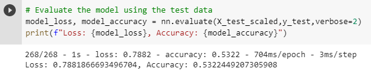
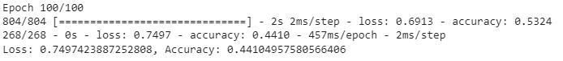
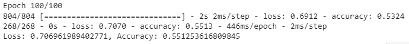
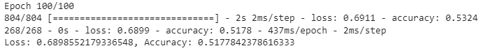
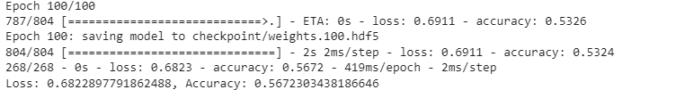

# Neural_Network_Charity_Analysis

## Overview

Alphabet Soup, is a nonprofit philanthropic foundation dedicated to help various organizations around the world. By building a deep learning neural network with an at least 75% predictive accuracy we will attempt to determine the success or failure of charitable donations to non-profits.

This neural network is built to help Alphabet Soup make future decisions on who should receive charitable grants based on historical data. The dataset contains information from 34,000 organizations which will be used to build a model with high predictive accuracy.

## Results

### Data Preprocessing

What variable(s) are considered the target(s) for your model?
- IS_SUCCESSFUL: was the money used effectively

What variable(s) are considered to be the features for your model?
- APPLICATION_TYPE: Alphabet Soup application type
- AFFILIATION: Affiliated sector of industry
- CLASSIFICATION: Government organization classification
- USE_CASE: Use case for funding
- ORGANIZATION: Organization type
- STATUS: Active status
- INCOME_AMT: Income classification
- SPECIAL_CONSIDERATIONS: Special consideration for application
- ASK_AMT: Funding amount requested

What variable(s) are neither targets nor features, and should be removed from the input data?
- EIN and NAME: Identification columns

## Original Model

### Neural Network First Pass Accuracy

* Two layers: 8,5
* Relu, Relu, Sigmoid

### Compiling, Training, and Evaluating the Model
* How many neurons, layers, and activation functions did you select for your neural network model, and why?
* What steps did you take to try and increase model performance?
* Were you able to achieve the target model performance?

### Attempt # 1

* Two layers: 10,6
* Relu, Tanh, Sigmoid
* Used original model neurons, layers, and activation functions - changed bin sizes
* Accuracy: 0.4410
* Attempt #1 - Target not achieved

### Attempt # 2

* Three layers: 10,6,3
* Relu, Relu, Tanh, Sigmoid
* Increased to 3 hidden layers
* Accuracy: 0.5513
* Attempt #2 - Target not achieved

### Attempt # 3

* Three layers: 10,6,3
* Linear, Tanh, Tanh, Sigmoid
* Accuracy: 0.5178
* Attempt #3 - Target not achieved

### Attempt # 4

* Three layers: 10,8
* Relu, Relu, Sigmoid
* Increased neurons from 8:5 to 10:8 and changed activation functions from relu:relu to relu:tanh
* Changed number of neurons and activation functions
* Accuracy: 0.5672
* Attempt #4 - Target not achieved

## Summary

Possibly due to overfitting, no attempt improved the accuracy of the model to be able to reach the 75% target.

Further attempts could be done to find the optimal parameters for a model that might achieve an accuracy of 75% or greater.

